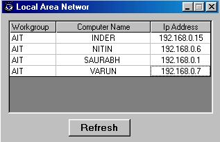



## AreaLan

### Description

Lan is a simple program which shows all the computers on the network which are currently open. Lan shows the workgroup Name, Computer Name and the Remote IP of Computer in a grid format. The program displays the caption in scrolling form. It is very simple program so, You can easily understand the program.
 
### More Info
 

             |
---                |---
**Submitted On**   |2002-03-05 23:52:50
**By**             |[inderpal](https://github.com/Planet-Source-Code/PSCIndex/blob/master/ByAuthor/inderpal.md)
**Level**          |Intermediate
**User Rating**    |4.9 (39 globes from 8 users)
**Compatibility**  |VB 5\.0, VB 6\.0
**Category**       |[Complete Applications](https://github.com/Planet-Source-Code/PSCIndex/blob/master/ByCategory/complete-applications__1-27.md)
**World**          |[Visual Basic](https://github.com/Planet-Source-Code/PSCIndex/blob/master/ByWorld/visual-basic.md)
**Archive File**   |[AreaLan619553132002\.zip](https://github.com/Planet-Source-Code/inderpal-arealan__1-32667/archive/master.zip)

